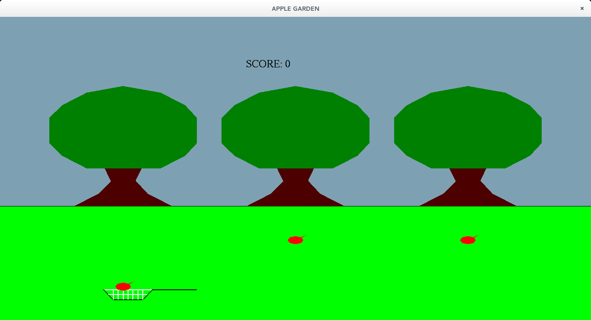
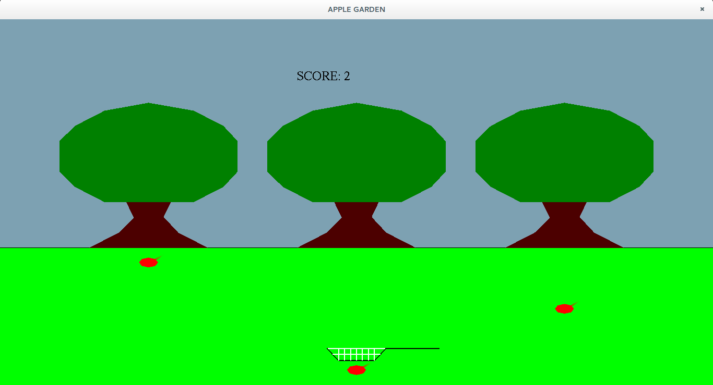
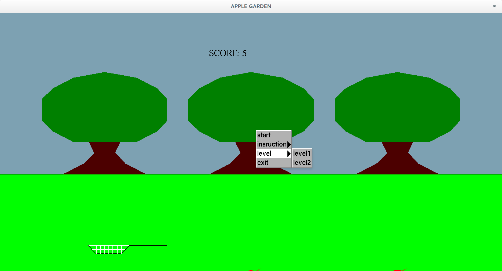

Apple Garden is a 2-dimentional apple game, wherein the user has to catch the apples in a net. The apples fall from three trees, with different speeds. The user has to catch these apples by moving the net either to the left, centre, or to the right. The scores keep incrementing as the apples are caught.
 The user is provided with a menu and the options are to be selected using the RIGHT MOUSE BUTTON. The menu is implemented to select the options as mentioned below.
•	START: To start the game.
•	LEVEL: To change the difficulties of the game. It consists of two levels, in which the speed of the falling apples increases with the increase in level.
•	INSTRUCTIONS: A guide to how to play the game.
•	EXIT: To quit the game.

The project is based on a simple window co-ordinates and using recursive techniques in OpenGL. The package is developed using computer graphics with OpenGL

